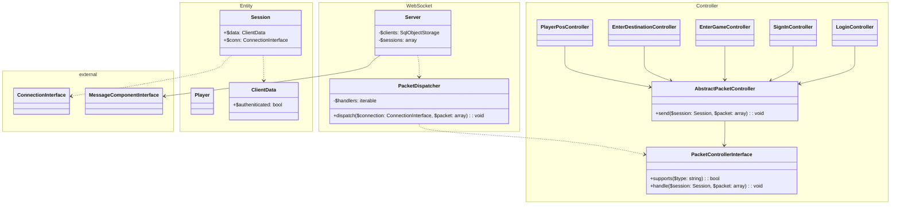

```mermaid
classDiagram
    namespace external {
        class ConnectionInterface
        class MessageComponentInterface
    }

    namespace Entity {
        class Player
        class Session {
            +$data: ClientData
            +$conn: ConnectionInterface
        }
        class ClientData {
            +$autheniticated: bool
        }
    }

    Session ..> ConnectionInterface
    Session ..> ClientData

    namespace Controller {
        class PacketControllerInterface {
            +supports($type: string): bool
            +handle($session: Session, $packet: array): void
        }

        class AbstractPacketController {
            +send($session: Session, $packet: array): void
        }

        class LoginController
        class SignInController
        class EnterGameController
        class EnterDestinationController
        class PlayerPosController
    }
    
    AbstractPacketController --> PacketControllerInterface

    LoginController --> AbstractPacketController
    SignInController --> AbstractPacketController
    EnterGameController --> AbstractPacketController
    EnterDestinationController --> AbstractPacketController
    PlayerPosController --> AbstractPacketController

    namespace WebSocket {
        class Server {
            -$clients: SqlObjectStorage
            -$sessions: array
        }

        class PacketDispatcher {
            -$handlers: iterable

            +dispatch($connection: ConnectionInterface, $packet: array): void
        }
    }

    Server ..> PacketDispatcher
    PacketDispatcher ..> PacketControllerInterface

    Server --> MessageComponentInterface

```