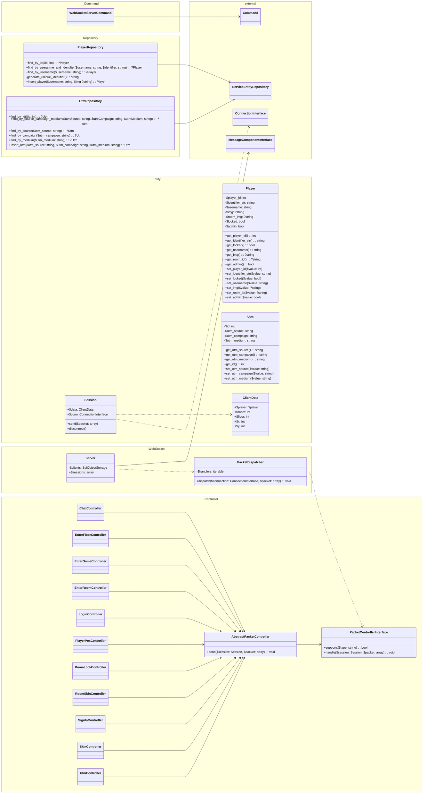

```mermaid
classDiagram
    direction LR
    namespace external {
        class ConnectionInterface
        class MessageComponentInterface
        class Command
        class ServiceEntityRepository
    }

    namespace Entity {
        class Player {
            -$player_id: int
            -$identifier_str: string
            -$username: string
            -$img: ?string
            -$room_img: ?string
            -$locked: bool
            -$admin: bool

            +get_player_id(): int
            +get_identifier_str(): string
            +get_locked(): bool
            +get_username(): string
            +get_img(): ?string
            +get_room_id(): ?string
            +get_admin(): bool
            
            +set_player_id($value: int)
            +set_identifier_str($value: string)
            +set_locked($value: bool)
            +set_username($value: string)
            +set_img($value: ?string)
            +set_room_id($value: ?string)
            +set_admin($value: bool)
        }

        class Utm {
            -$id: int
            -$utm_source: string
            -$utm_campaign: string
            -$utm_medium: string

            +get_utm_source(): string
            +get_utm_campaign(): string
            +get_utm_medium(): string
            +get_id(): int

            +set_utm_source($value: string)
            +set_utm_campaign($value: string)
            +set_utm_medium($value: string)
        }

        class Session {
            +$data: ClientData
            +$conn: ConnectionInterface

            +send($packet: array)
            +disconnect()
        }

        class ClientData {
            +$player: ?player
            +$room: int
            +$floor: int
            +$x: int
            +$y: int
        }
    }

    Session ..> ConnectionInterface
    Session ..> ClientData

    namespace Controller {
        class PacketControllerInterface {
            +supports($type: string): bool
            +handle($session: Session, $packet: array): void
        }

        class AbstractPacketController {
            +send($session: Session, $packet: array): void
        }

        class ChatController
        class EnterFloorController
        class EnterGameController
        class EnterRoomController
        class LoginController
        class PlayerPosController
        class RoomLockController
        class RoomSkinController
        class SignInController
        class SkinController
        class UtmController
    }
    
    AbstractPacketController --> PacketControllerInterface
    
    ChatController --> AbstractPacketController
    EnterFloorController --> AbstractPacketController
    EnterGameController --> AbstractPacketController
    EnterRoomController --> AbstractPacketController
    LoginController --> AbstractPacketController
    PlayerPosController --> AbstractPacketController
    RoomLockController --> AbstractPacketController
    RoomSkinController --> AbstractPacketController
    SignInController --> AbstractPacketController
    SkinController --> AbstractPacketController
    UtmController --> AbstractPacketController

    namespace WebSocket {
        class Server {
            -$clients: SqlObjectStorage
            +$sessions: array
        }

        class PacketDispatcher {
            -$handlers: iterable

            +dispatch($connection: ConnectionInterface, $packet: array): void
        }
    }

    Server ..> PacketDispatcher
    PacketDispatcher ..> PacketControllerInterface

    Server --> MessageComponentInterface

    namespace _Command {
        class WebSocketServerCommand
    }

    WebSocketServerCommand --> Command

    namespace Repository {
        class PlayerRepository {
            +find_by_id($id: int): ?Player
            +find_by_useranme_and_identifier($username: string, $identifier: string): ?Player
            +find_by_username($username: string): ?Player
            -generate_unique_identifier(): string
            +insert_player($username: string, $img ?string): Player
        }

        class UtmRepository {
            +find_by_id($id: int): ?Utm
            +find_by_source_campaign_medium($utmSource: string, $utmCampaign: string, $utmMedium: string): ?utm
            +find_by_source($utm_source: string): ?Utm
            +find_by_campaign($utm_campaign: string): ?Utm
            +find_by_medium($utm_medium: string): ?Utm
            +insert_utm($utm_source: string, $utm_campaign: string, $utm_medium: string): Utm
        }
    }
    
    PlayerRepository --> ServiceEntityRepository
    UtmRepository --> ServiceEntityRepository
```